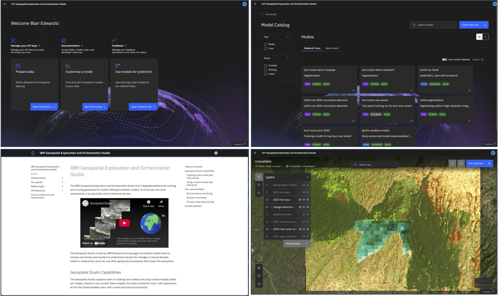
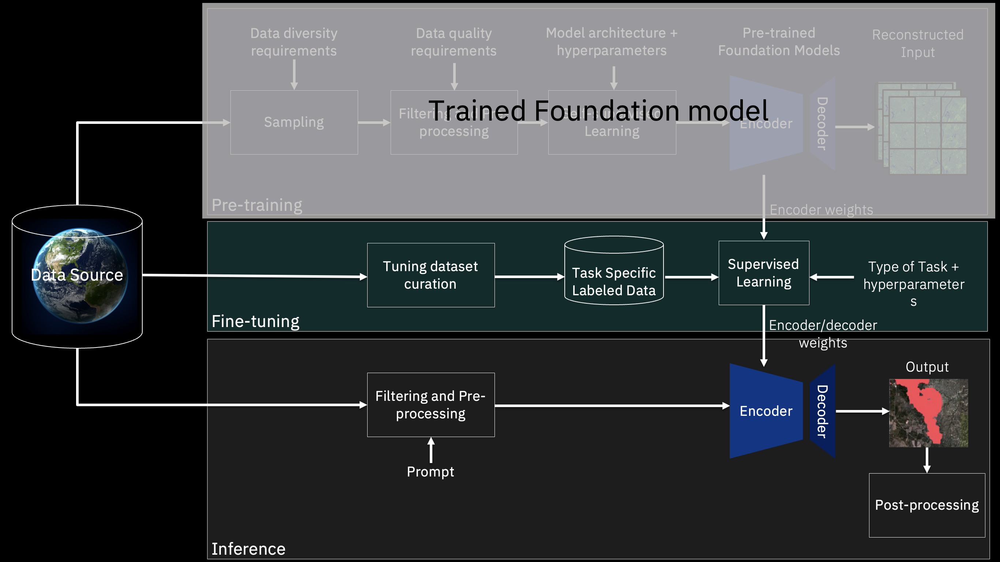
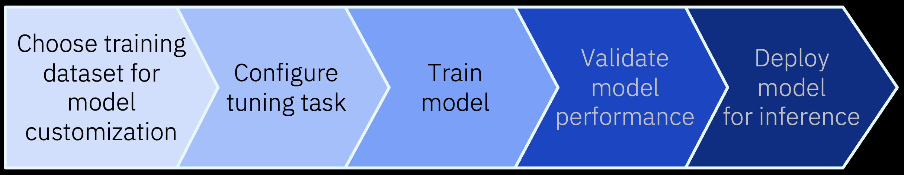
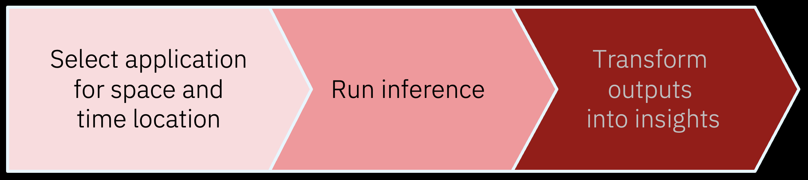

# Getting Started with Geospatial Studio

## What is Geospatial Studio?

The **Geospatial Exploration and Orchestration Studio** is an integrated platform for **fine-tuning, inference, and orchestration of geospatial AI models**. It combines a **no-code UI**, **low-code SDK**, and APIs to make working with geospatial data and AI accessible to everyone, from researchers to developers.

The platform supports **on-prem or cloud deployment** using **Red Hat OpenShift** or **Kubernetes**, enabling scalable pipelines for data preparation, model training, and inference.

## Geospatial Studio Capabilities

The Geospatial Studio supports users in creating new models and using trained models (either pre-loaded, shared or user-tuned). Below are the steps involved for each, with explanation of how the Studio enables users with current and future functionality.

## Key Capabilities

The Geospatial Studio builds upon the broader ecosystem utilizing:
- [TerraTorch](https://github.com/terrastackai/terratorch) for model fine-tuning and inference
- [TerraKit](https://github.com/terrastackai/terrakit) for geospatial data search, query and processing

### Dataset Factory
The Studio allows users to onboard their curated data for fine-tuning. Using [TerraKit](https://terrastackai.github.io/terrakit/), the platform can find and fetch data from various data connectors:

- Sentinel Hub
- NASA Earthdata
- Sentinel AWS
- IBM Research STAC
- The Weather Company

When onboarding datasets, you define:
- Data connectors and sources (collections, bands)
- Dataset information (name, description, file suffixes)
- Configurations for data onboarding and fetching

The Studio supports both multi-modal and uni-modal datasets.

### Fine-Tuning

As a user, when you want to train a new model for a specific application, there are a number of steps you need to go through to prepare for the training, then train and monitor, before assessment and deployment of any new model. The main stages in that process are described in the chevron diagram below. The Studio provides support at each step.

To run a fine-tuning task, you need to select:

1. **Tuning task type** - The learning task (segmentation, regression, etc.)
2. **Fine-tuning dataset** - Training data for your application
3. **Base foundation model (Backbone)** - Starting point for tuning

#### Supported Models

| Model Family | Backbone Models | Tuning Templates |
|--------------|----------------|------------------|
| [Prithvi](https://huggingface.co/ibm-nasa-geospatial) | Prithvi_EO_V1_100M, Prithvi_EO_V2_300M, Prithvi_EO_V2_600M, Prithvi_EO_V2_600M_TL | Segmentation, Regression |
| [Terramind](https://huggingface.co/ibm-esa-geospatial) | terramind_v1_large, terramind_v1_base | terramind: Segmentation |
| Clay | clay_v1_base | clay_v1: Segmentation |
| ResNet | timm_resnet18, timm_resnet34, timm_resnet50, timm_resnet101, timm_resnet152 | timm_resnet: Segmentation |
| Convnext | timm_convnext_large, timm_convnext_xlarge | timm_convnext: Segmentation |

### Inference

If a model already exists for the given application (either one which was pre-existing, or one you have tuned and deployed), we can drive the model using the inference service. This handles data preparation and passing, as well as post-processing of model outputs and visualization. As with fine-tuning, there are a few steps involved and the Studio is designed to support users and simplify access to such models.

The Studio provides a no-code portal for running inference with fine-tuned models and visualizing results. Users can:
- Select a model
- Define spatial domain and temporal range
- Let the backend handle data preparation and processing
- Visualize results in the UI

## Next Steps

Choose your path to get started:

- **[Installation Guide](installation.md)** - Deploy the Geospatial Studio
- **[First Steps](first-steps.md)** - Initial setup after deployment
- **[UI Guide](getting-started-UI.md)** - Learn to use the web interface
- **[SDK Guide](getting-started-SDK.md)** - Programmatic access with Python

## Use Case Examples

### Environmental Monitoring
Monitoring Kenya's Water Towers and government efforts to protect and reforest large areas. Including potential for carbon sequestration and carbon markets.

<iframe width="560" height="315" src="https://www.youtube.com/embed/CTv2sOYOQyc?si=6k9v0UEWlZ8NPAcv" title="YouTube video player" frameborder="0" allow="autoplay; encrypted-media;" allowfullscreen></iframe>

### Disaster Monitoring
AI automation for monitoring floods and translation into affected assets, shown here for the floods in Kenya earlier this year.

<iframe width="560" height="315" src="https://www.youtube.com/embed/P01VIRJ7n_k?si=4TXMQqqywl2Wggi_" title="YouTube video player" frameborder="0" allow="autoplay; encrypted-media;" allowfullscreen></iframe>

### Climate Model Downscaling
Improving the spatial resolution of outputs from computationally intensive weather and climate simulation models to provide the required detail for carrying out climate risk assessment. Similar can be used to improve short term renewables forecasting.

<iframe width="560" height="315" src="https://www.youtube.com/embed/K6jhFWwBqfo?si=J1ESfgpWrpFdBmf3" title="YouTube video player" frameborder="0" allow="autoplay; encrypted-media;" allowfullscreen></iframe>

## Provide Feedback

If you'd like to provide feedback, [submit a feature request or report an issue](https://github.com/terrastackai/geospatial-studio).