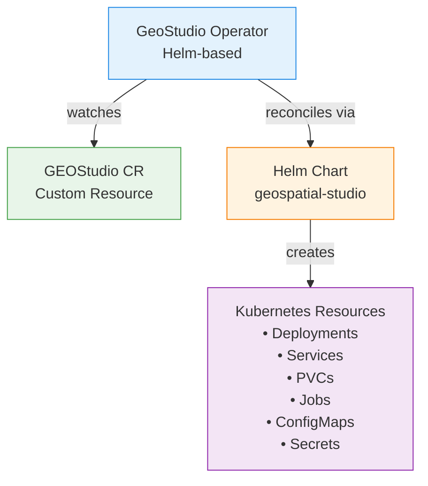
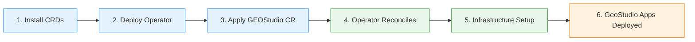

# GeoStudio Operator

The GeoStudio Operator is a Kubernetes operator built using the [Operator Framework](https://operatorframework.io/) with Helm. It automates the deployment, configuration, and lifecycle management of GeoStudio on Kubernetes and OpenShift clusters.

## Directory Structure

```
geospatial-studio/
├── geostudio                        # 🆕 Unified CLI at project root
├── lib/                             # Shared CLI libraries
│   ├── common.sh                    # Logging, colors, utilities
│   ├── k8s-utils.sh                 # Kubernetes helpers
│   ├── operator-commands.sh         # Operator management
│   ├── app-commands.sh              # Application management
│   └── build-commands.sh            # Build functionality
├── operators/                       # Operator configuration
│   ├── config/                      # CRDs, RBAC, manifests
│   │   ├── crd/                     # Custom Resource Definitions
│   │   ├── rbac/                    # RBAC roles and bindings
│   │   ├── manager/                 # Operator deployment manifests
│   │   └── default/                 # Kustomize overlay
│   ├── examples/                    # Example GeoStudio CRs
│   │   └── geostudio-operator-template.yaml
│   ├── watches.yaml                 # Operator watch configuration
│   └── Makefile                     # Build and deploy targets
├── geospatial-studio/               # Helm chart
├── Dockerfile.operator              # Production operator build
└── Dockerfile.operator.local        # Local operator build
```

## Architecture

### High-Level Architecture



**Component Description:**

1. **GeoStudio Operator**: Watches for `GEOStudio` custom resources and reconciles the desired state
2. **GEOStudio CR**: User-defined configuration declaring the desired GeoStudio deployment
3. **Helm Chart**: Contains all Kubernetes manifests and templates for GeoStudio components
4. **Kubernetes Resources**: The actual deployed resources (pods, services, volumes, etc.)

### Installation Flow



### Helm Hook Execution Order

The GeoStudio Helm chart uses hooks to ensure components are deployed in the correct order:

```
Hook Weight    Component                 Purpose
═══════════    ════════════════════════  ══════════════════════════════════
   -100        PostgreSQL Installer      Deploy PostgreSQL database
    -90        PostgreSQL DB Creator     Create required databases
    -80        Keycloak/MinIO Installer  Deploy auth and object storage
    -75        CSI Driver Installer      Install S3 CSI driver (if enabled)
    -70        Keycloak Configurator     Configure realms, clients, users
    -70        MinIO Bucket Creator      Create S3 buckets
    -60        GeoServer PVC             Create GeoServer storage
    -55        GeoServer Installer       Deploy GeoServer
    -50        GeoServer Configurator    Configure workspaces, WMS
     0         Main Application          Deploy Gateway, UI, MLflow, Pipelines
```

## Quick Start - Local Development


### Step 1: Set up Kubeconfig

```bash
# Point kubectl to your Lima cluster
export KUBECONFIG="$HOME/.lima/studio/copied-from-guest/kubeconfig.yaml"

# Verify connection
kubectl cluster-info
```

### Step 2: Install Operator

Install the operator using the helm chart from quay.io:

```bash
./geostudio operator install --prod --version latest
```

### Step 3: Deploy Application

Deploy a GEOStudio application instance:

```bash
./geostudio app deploy
```

### Step 4: Verify Deployment

Monitor the deployment progress:

```bash
# Check operator status
./geostudio operator status

# Check application status
./geostudio app status

# Watch application pods
kubectl get pods -n default -w

# View operator logs
./geostudio operator logs --follow
```

### Step 5: Access the Application

Once deployed, port-forward to access services:

```bash
# Auth Server
kubectl port-forward svc/keycloak 8080:8080 -n default

# UI
kubectl port-forward svc/geofm-ui 4180:4180 -n default

# API Gateway
kubectl port-forward svc/geofm-gateway 4181:4181 -n default

# MLflow
kubectl port-forward svc/geofm-mlflow 5000:5000 -n default
```

Access in your browser:
 **UI:** http://localhost:4180
 **API:** http://localhost:4181
 **MLflow:** http://localhost:5000

## CLI Reference

### Build Commands

```bash
# Build for local development
./geostudio build --local

# Build for production
./geostudio build --prod --version v1.0.0
```

### Operator Commands

```bash
# Install operator (local development)
./geostudio operator install --local

# Install operator (production)
./geostudio operator install --prod --version v0.1.0

# Check operator status
./geostudio operator status

# View operator logs
./geostudio operator logs --follow

# Restart operator
./geostudio operator restart

# Uninstall operator
./geostudio operator uninstall
```

### Application Commands

```bash
# Deploy application (default: lima/default)
./geostudio app deploy

# Deploy to different environment/namespace
./geostudio app deploy --env production --namespace prod

# Generate manifest without deploying
./geostudio app deploy --dry-run

# List all deployed instances
./geostudio app list

# Check application status
./geostudio app status --namespace prod

# View application logs
./geostudio app logs --component gateway --follow

# Restart application
./geostudio app restart --namespace prod

# Delete application
./geostudio app delete --namespace staging
```

## Complete Workflows

### Local Development Setup

Sample Custom Resource Spec: [GEOStudio custom resource](examples/geostudio-operator-template.yaml)

After making changes to the Helm chart or operator:

```bash
# 1. Rebuild operator
./geostudio build --local

# 2. [OPTIONAL: If you have installed it previously] Delete current deployment
./geostudio app delete

# 3. [OPTIONAL: If you have installed it previously] Uninstall operator
./geostudio operator uninstall

# 4. Reinstall operator
./geostudio operator install --local

# 5. Deploy fresh instance
./geostudio app deploy

# 6. Check status
./geostudio operator status
./geostudio app status
```

### Production Deployment

For production deployments, build and push the image, then install:

```bash
# 1. Build and push to registry
./geostudio build --prod --version v1.0.0

# 2. Install operator from registry
./geostudio operator install --prod --version v1.0.0

# 3. Deploy application
./geostudio app deploy --env production --namespace prod
```

### Clean Up

```bash
# Delete application only
./geostudio app delete --namespace default

# Complete cleanup (apps + operator + CSI driver)
./geostudio app delete
./geostudio operator uninstall
```

./geostudio app delete --namespace default

#### Delete everything (app + operator)

```bash
./geostudio app delete
./geostudio operator uninstall
```

## After Deployment

| | |
|---|---|
| Access the Studio UI | [https://localhost:4180](https://localhost:4180) |
| Access the Studio API | [https://localhost:4181](https://localhost:4181) |
| Authenticate Studio | username: `testuser` password: `testpass123` |
| Access Geoserver | [http://localhost:3000/geoserver](http://localhost:3000/geoserver) |
| Authenticate Geoserver | username: `admin` password: `geoserver` |
| Access MLflow | [http://localhost:5000](http://localhost:5000) |
| Access Keycloak | [http://localhost:8080](http://localhost:8080) |
| Authenticate Keycloak  | username: `admin` password: `admin` |
| Access Minio | Console: [https://localhost:9001](https://localhost:9001)      API: [https://localhost:9000](https://localhost:9000) |
| Authenticate Minio | username: `minioadmin` password: `minioadmin` |

If you need to restart any of the port-forwards you can use the following commands:

```shell
kubectl port-forward -n $OC_PROJECT svc/keycloak 8080:8080 >> studio-pf.log 2>&1 &
kubectl port-forward -n $OC_PROJECT svc/postgresql 54320:5432 >> studio-pf.log 2>&1 &
kubectl port-forward -n $OC_PROJECT svc/geofm-geoserver 3000:3000 >> studio-pf.log 2>&1 &
kubectl port-forward -n $OC_PROJECT deployment/geofm-ui 4180:4180 >> studio-pf.log 2>&1 &
kubectl port-forward -n $OC_PROJECT deployment/geofm-gateway 4181:4180 >> studio-pf.log 2>&1 &
kubectl port-forward -n $OC_PROJECT deployment/geofm-mlflow 5000:5000 >> studio-pf.log 2>&1 &
kubectl port-forward -n $OC_PROJECT svc/minio 9001:9001 >> studio-pf.log 2>&1 &
kubectl port-forward -n $OC_PROJECT svc/minio 9000:9000 >> studio-pf.log 2>&1 &
```
