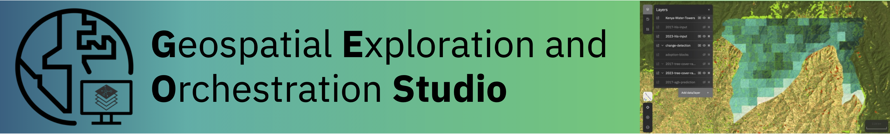

# IBM Geospatial Studio Workshop



Welcome to the **IBM Geospatial Studio Workshop**! This hands-on workshop will guide you through deploying and using the Geospatial Exploration and Orchestration Studio - an integrated platform for fine-tuning, inference, and orchestration of geospatial AI models.

## 🎯 Workshop Overview

This workshop is designed for beginners who have never heard of Geospatial Studio before. By the end of this workshop, you will be able to:

- ✅ Deploy Geospatial Studio in your environment
- ✅ Navigate the Studio UI and understand its components
- ✅ Use the Python SDK to interact with the platform
- ✅ Run inference with fine-tuned geospatial AI models
- ✅ Onboard and prepare datasets for model training
- ✅ Fine-tune models for specific geospatial tasks
- ✅ Execute end-to-end workflows for real-world applications

## ⏱️ Workshop Duration

**Total Time:** Approximately 3-4 hours

- **Pre-work:** 1-1.5 hours (deployment and setup)
- **Introduction:** 15 minutes (reading)
- **Lab 1 - Getting Started with IBM Geospatial Studio:** 10 minutes (Beginner)
- **Lab 2 - Onboarding Pre-computed Examples:** 20 minutes (Beginner)
- **Lab 3 - Upload Model Checkpoints and Run Inference:** 30 minutes (Intermediate)
- **Lab 4 - Training a Custom Model for Wildfire Burn Scar Detection:** 60-90 minutes (Intermediate, includes model training)

## 🎓 Target Audience

This workshop is ideal for:

- Data scientists interested in geospatial AI
- Researchers working with satellite imagery
- Developers building geospatial applications
- Anyone curious about applying AI to Earth observation data

**Prerequisites:** Basic knowledge of Python and familiarity with Jupyter notebooks is helpful but not required.

## 📦 Getting Workshop Materials

Before starting the labs, clone the workshop repository to access all notebooks and configuration files:

```bash
git clone https://github.com/terrastackai/geospatial-studio.git
cd geospatial-studio/workshop/docs/notebooks
```

This repository includes:

- ✅ All lab notebooks (Lab 1-4)
- ✅ JSON configuration files (model templates, datasets, backbones)
- ✅ Sample data references
- ✅ Complete workshop documentation

**Alternative:** You can download individual notebooks from each lab page, but you'll need to manually download associated JSON files for Labs 3 and 4.

## 🏗️ What is Geospatial Studio?

The **Geospatial Exploration and Orchestration Studio** is an integrated platform that combines:

- **No-code UI** for visual interaction
- **Low-code SDK** for programmatic access
- **RESTful APIs** for integration

It supports the complete machine learning lifecycle for geospatial data:

1. **Dataset Management** - Onboard, validate, and prepare training data
2. **Model Fine-tuning** - Customize foundation models for specific tasks
3. **Inference at Scale** - Run models on large geospatial datasets
4. **Visualization** - View and analyze results interactively

Built on top of:

- [**TerraTorch**](https://github.com/terrastackai/terratorch) - Model fine-tuning and inference
- [**TerraKit**](https://github.com/terrastackai/terrakit) - Geospatial data processing
- [**Iterate**](https://github.com/terrastackai/iterate) - Hyperparameter optimization

## 📋 Workshop Structure

### Pre-work (Required)
Complete before the workshop begins. You'll deploy Geospatial Studio in your environment and verify the installation.

[Start Pre-work →](prework/index.md){ .md-button .md-button--primary }

### Introduction
Learn about Geospatial Studio's architecture, key concepts, and capabilities.

### Lab 1: Getting Started with IBM Geospatial Studio
Explore the three ways to interact with Studio: UI, API, and SDK. Navigate the interface, generate API keys, install the Python SDK, and make your first API calls. Perfect for fresh deployments!

**Time:** 10 minutes | **Difficulty:** Beginner

### Lab 2: Onboarding Pre-computed Examples
Learn how to onboard pre-computed inference examples and geospatial layers. Configure styling for raster and vector data visualization.

**Time:** 20 minutes | **Difficulty:** Beginner

### Lab 3: Upload Model Checkpoints and Run Inference
Upload fine-tuned model checkpoints and run inference on new geographic areas. Learn to define spatial/temporal domains and visualize results.

**Time:** 30 minutes | **Difficulty:** Intermediate

### Lab 4: Training a Custom Model for Wildfire Burn Scar Detection
Complete an end-to-end workflow: onboard a training dataset, fine-tune a foundation model for wildfire burn scar detection, and run inference on real wildfire events.

**Time:** 60-90 minutes (includes model training) | **Difficulty:** Intermediate

**Note:** This lab requires GPU access for model training. If GPUs are not available, you can use an existing fine-tuned model or train outside Studio using TerraTorch.

## 🚀 Getting Started

1. **Complete the Pre-work** - Deploy Geospatial Studio in your environment
2. **Follow the Labs** - Work through each lab sequentially
3. **Experiment** - Try the exercises and explore on your own
4. **Ask Questions** - Use the troubleshooting guide and FAQ

## 📚 Additional Resources

- [Geospatial Studio Documentation](https://terrastackai.github.io/geospatial-studio/)
- [SDK Documentation](https://terrastackai.github.io/geospatial-studio-toolkit/)
- [GitHub Repository](https://github.com/terrastackai/geospatial-studio)
- [Example Notebooks](https://github.com/terrastackai/geospatial-studio-toolkit/tree/main/examples)

## 🤝 Contributing
Found an issue or have suggestions? Please open an issue on our [GitHub repository](https://github.com/terrastackai/geospatial-studio).


## 📄 License

This workshop is licensed under the Apache License 2.0.

---

Ready to begin? Start with the [Pre-work →](prework/index.md)