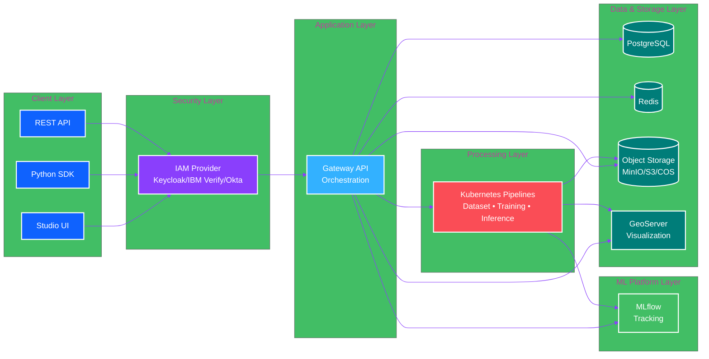
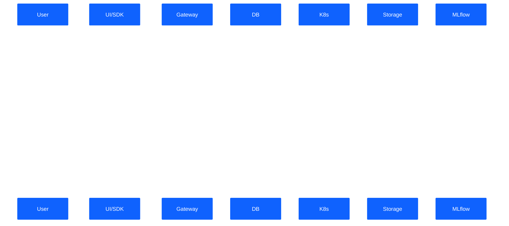
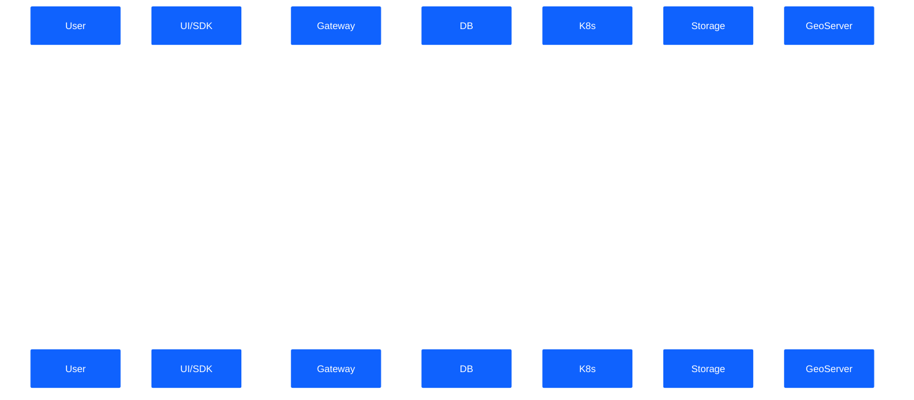
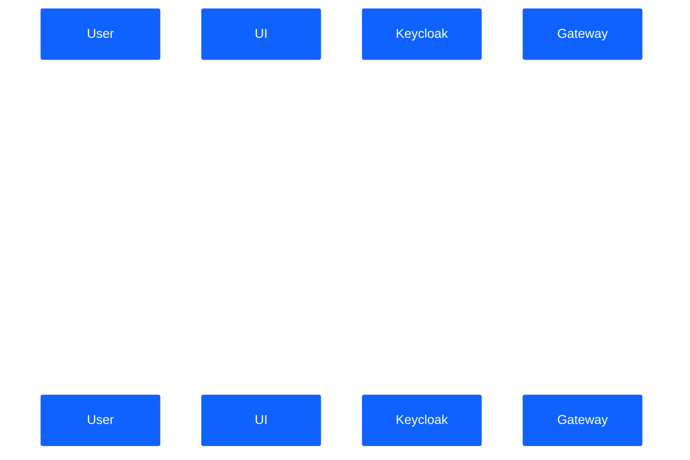
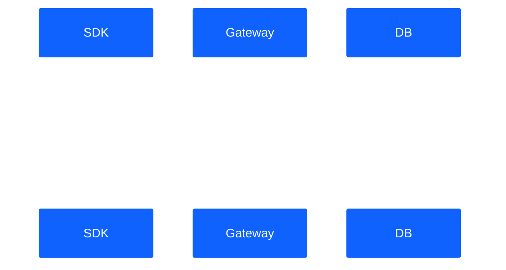

# Architecture Overview

Understanding the Geospatial Studio architecture helps you make the most of the platform and troubleshoot issues effectively.

## 🏗️ High-Level Architecture

Geospatial Studio follows a layered microservices architecture deployed on Kubernetes/OpenShift:



**Architecture Layers:**

1. **Client Layer**: Multiple interfaces (UI, SDK, API) for different user needs
2. **Security Layer**: OAuth2-based authentication with flexible IAM provider options (Keycloak, IBM Verify, Okta)
3. **Application Layer**: Gateway API orchestrates all backend services and workflows
4. **Data & Storage Layer**: Flexible storage options - in-cluster (PostgreSQL, MinIO) or cloud-managed (IBM Cloud, AWS, Azure, GCP), plus GeoServer for geospatial visualization
5. **ML Platform Layer**: MLflow for experiment tracking and model versioning
6. **Processing Layer**: Kubernetes-native pipelines for dataset processing, model training, and inference execution

## 🔧 Core Components

### 1. Gateway API

**Purpose:** Central orchestration point for all backend services

**Responsibilities:**
- Route requests to appropriate services
- Manage authentication and authorization
- Coordinate complex workflows
- Handle API versioning

**Technology:** FastAPI (Python)

**Endpoints:**
- `/v2/models` - Model management
- `/v2/datasets` - Dataset operations
- `/v2/tunes` - Fine-tuning tasks
- `/v2/inferences` - Inference execution

### 2. Studio UI

**Purpose:** No-code web interface for visual interaction

**Features:**
- Interactive map visualization
- Dataset catalog and preview
- Model catalog and management
- Training progress monitoring
- Inference configuration and execution

**Technology:** Web Components, Carbon Design System

**Pages:**
- Home - Quick access to key features
- Data Catalog - Browse and manage datasets
- Model Catalog - Browse and manage models
- Inference Lab - Run and visualize inferences

### 3. Authentication (Keycloak)

**Purpose:** Secure access control and user management

**Features:**
- OAuth2/OpenID Connect
- User and role management
- API key generation
- Single sign-on (SSO)

**Default Credentials (Development):**
- Admin: `admin` / `admin`
- Test User: `testuser` / `testpass123`

### 4. Database (PostgreSQL)

**Purpose:** Store metadata and application state

**Stores:**
- User information
- Dataset metadata
- Model configurations
- Training job details
- Inference history
- API keys

**Version:** PostgreSQL 15.x

### 5. Object Storage (MinIO)

**Purpose:** Store large files and artifacts

**Stores:**
- Training datasets
- Model checkpoints
- Inference outputs
- Logs and artifacts

**S3-Compatible:** Can be replaced with AWS S3, IBM Cloud Object Storage, etc.

**Buckets:**
- `datasets` - Training data
- `models` - Model artifacts
- `inferences` - Inference outputs
- `mlflow` - MLflow artifacts

### 6. Cache & Queue (Redis)

**Purpose:** Performance optimization and task management

**Uses:**
- API response caching
- Session management
- Message queuing for async tasks
- Rate limiting

**Version:** Redis 8.x

### 7. Experiment Tracking (MLflow)

**Purpose:** Track and compare model training experiments

**Features:**
- Log training metrics
- Store model artifacts
- Compare experiments
- Model registry

**Access:** http://localhost:5000 (local deployment)

### 8. Visualization (GeoServer)

**Purpose:** Serve geospatial data for map visualization

**Features:**
- WMS/WFS services
- Dynamic styling
- Layer management
- Tile caching

**Access:** http://localhost:3000/geoserver (local deployment)

## 🔄 Data Flow

### Fine-Tuning Workflow



### Inference Workflow

#### High-Level Sequence



#### Detailed Pipeline Orchestration

The inference pipeline orchestrates parallel processing of geospatial data through modular, scalable microservices. When an inference request is received, the **Inference Planner** analyzes the spatial and temporal requirements, then breaks down the work into parallel subtasks. Each subtask processes a specific geographic area and time period independently, enabling efficient large-scale processing.

```mermaid
%%{init: {'theme':'base', 'themeVariables': { 'primaryColor':'#0f62fe','primaryTextColor':'#fff','primaryBorderColor':'#fff','lineColor':'#8a3ffc','secondaryColor':'#33b1ff','tertiaryColor':'#42be65'}}}%%
flowchart LR
 subgraph subGraph0["Pipeline Process"]
        D["Inference Planner<br/>Spatial-Temporal Analysis"]
  end
 subgraph subGraph1["Pipeline Subtask 0"]
        F["TerraKit Data Pull<br/>Satellite Imagery"]
        G["Run Inference<br/>Model Prediction"]
        H["Post-Processing<br/>Masking & Filtering"]
        I["Push to GeoServer<br/>Visualization"]
  end
 subgraph subGraph2["Pipeline Subtask 1"]
        J["TerraKit Data Pull"]
        K["Run Inference"]
        L["Post-Processing"]
        M["Push to GeoServer"]
  end
 subgraph subGraph3["Pipeline Subtask 2"]
        N["TerraKit Data Pull"]
        O["Run Inference"]
        P["Post-Processing"]
        Q["Push to GeoServer"]
  end
    A(["Inference Request"]) --> B["Gateway API"]
    B --> C["PlannerTask Database"]
    C --> D
    D --> E["PipelineTasks Database"]
    E --> F
    E --> J
    E --> N
    F --> G
    G --> H
    H --> I
    J --> K
    K --> L
    L --> M
    N --> O
    O --> P
    P --> Q
    
    style D fill:#42be65,stroke:#fff,stroke-width:2px,color:#fff
    style F fill:#fa4d56,stroke:#fff,stroke-width:2px,color:#fff
    style G fill:#fa4d56,stroke:#fff,stroke-width:2px,color:#fff
    style H fill:#fa4d56,stroke:#fff,stroke-width:2px,color:#fff
    style I fill:#fa4d56,stroke:#fff,stroke-width:2px,color:#fff
    style J fill:#fa4d56,stroke:#fff,stroke-width:2px,color:#fff
    style K fill:#fa4d56,stroke:#fff,stroke-width:2px,color:#fff
    style L fill:#fa4d56,stroke:#fff,stroke-width:2px,color:#fff
    style M fill:#fa4d56,stroke:#fff,stroke-width:2px,color:#fff
    style N fill:#fa4d56,stroke:#fff,stroke-width:2px,color:#fff
    style O fill:#fa4d56,stroke:#fff,stroke-width:2px,color:#fff
    style P fill:#fa4d56,stroke:#fff,stroke-width:2px,color:#fff
    style Q fill:#fa4d56,stroke:#fff,stroke-width:2px,color:#fff
    style A fill:#8a3ffc,stroke:#fff,stroke-width:2px,color:#fff
    style B fill:#33b1ff,stroke:#fff,stroke-width:2px,color:#fff
    style C fill:#007d79,stroke:#fff,stroke-width:2px,color:#fff
    style E fill:#007d79,stroke:#fff,stroke-width:2px,color:#fff
```



**Pipeline Components:**

| Component | Purpose |
|-----------|---------|
| **Inference Planner** | Analyzes spatial-temporal requirements and creates parallel subtasks |
| **TerraKit Data Pull** | Acquires satellite imagery from Sentinel Hub, NASA Earthdata, AWS, etc. |
| **URL Connector** | Processes user-provided geospatial data |
| **Run Inference** | Executes model predictions using TerraTorch |
| **Post-Processing** | Applies masks for cloud cover, water, ice, snow, etc. |
| **Push to GeoServer** | Publishes results as WMS/WFS layers for visualization |

**Key Features:**

- **Parallel Processing**: Subtasks run concurrently for faster completion
- **Scalable**: Each component can scale independently based on workload
- **Modular**: Components are loosely coupled and can be updated independently
- **Fault Tolerant**: Failed tasks can be retried without affecting other subtasks
- **Priority Queuing**: Tasks can be prioritized for urgent processing

## 🚀 Deployment Architecture

### Local Deployment (Lima VM)

```
┌─────────────────────────────────────┐
│         Host Machine                │
│  ┌───────────────────────────────┐  │
│  │      Lima VM (K8s)            │  │
│  │  ┌─────────────────────────┐  │  │
│  │  │  Geospatial Studio      │  │  │
│  │  │  - Gateway API          │  │  │
│  │  │  - UI                   │  │  │
│  │  │  - PostgreSQL           │  │  │
│  │  │  - MinIO                │  │  │
│  │  │  - Keycloak             │  │  │
│  │  │  - MLflow               │  │  │
│  │  │  - GeoServer            │  │  │
│  │  │  - Redis                │  │  │
│  │  └─────────────────────────┘  │  │
│  └───────────────────────────────┘  │
│         ↕ Port Forwarding           │
│    localhost:4180 → UI              │
│    localhost:4181 → API             │
└─────────────────────────────────────┘
```

**Characteristics:**
- Single-node Kubernetes
- CPU-only (no GPU)
- Data persisted in `~/studio-data`
- Port forwarding for access
- **Fixed in-cluster services only** (no external service configuration)
- All services (PostgreSQL, MinIO, Keycloak) deployed within Lima VM

### Cluster Deployment (OpenShift/K8s)

```
┌─────────────────────────────────────────────────────────┐
│         Kubernetes/OpenShift Cluster                    │
│  ┌───────────────────────────────────────────────────┐  │
│  │  Namespace: geospatial-studio                     │  │
│  │  ┌─────────────────────────────────────────────┐  │  │
│  │  │  Core Services                              │  │  │
│  │  │  - Gateway (3 replicas)                     │  │  │
│  │  │  - UI (3 replicas)                          │  │  │
│  │  │  - PostgreSQL (HA) OR External DB           │  │  │
│  │  │  - Redis (HA)                               │  │  │
│  │  │  - MinIO OR External Object Storage         │  │  │
│  │  │  - Keycloak OR External OAuth               │  │  │
│  │  └─────────────────────────────────────────────┘  │  │
│  │  ┌─────────────────────────────────────────────┐  │  │
│  │  │  ML Services                                │  │  │
│  │  │  - MLflow                                   │  │  │
│  │  │  - GeoServer                                │  │  │
│  │  └─────────────────────────────────────────────┘  │  │
│  │  ┌─────────────────────────────────────────────┐  │  │
│  │  │  Processing (GPU Nodes)                     │  │  │
│  │  │  - Fine-tuning Jobs                         │  │  │
│  │  │  - Inference Pipelines                      │  │  │
│  │  └─────────────────────────────────────────────┘  │  │
│  └───────────────────────────────────────────────────┘  │
│         ↕ Ingress/Routes                                │
│    https://studio.domain.com                            │
│                                                          │
│  External Services (Optional):                          │
│  - IBM Cloud Databases / AWS RDS / Azure PostgreSQL     │
│  - IBM COS / AWS S3 / Azure Blob Storage                │
│  - IBM Security Verify / External Keycloak / Okta       │
└─────────────────────────────────────────────────────────┘
```

**Characteristics:**
- Multi-node cluster
- GPU acceleration available
- High availability
- **Flexible service configuration:**
  - In-cluster services (PostgreSQL, MinIO, Keycloak)
  - OR external cloud-managed services
- Load balancing
- Auto-scaling

### Service Configuration Comparison

| Service | Local Deployment | Cluster Deployment |
|---------|-----------------|-------------------|
| **PostgreSQL** | In-cluster only | In-cluster OR cloud-managed (IBM Cloud, AWS RDS, Azure, GCP) |
| **Object Storage** | MinIO in-cluster only | MinIO in-cluster OR cloud storage (IBM COS, AWS S3, Azure, GCP) |
| **Authentication** | Keycloak in-cluster only | Keycloak in-cluster OR external OAuth (IBM Verify, Okta, Azure AD) |
| **Configuration** | Fixed, no options | Fully configurable via values.yaml |
| **Use Case** | Learning, testing | Development, staging, production |

## 🔐 Security Architecture

### Authentication Flow



### API Key Authentication



## 📊 Resource Requirements

### Minimum (Local Deployment)
- **CPU:** 8 cores
- **RAM:** 16 GB
- **Disk:** 100 GB
- **GPU:** None (CPU only)

### Recommended (Cluster Deployment)
- **Worker Nodes:** 3-5
- **CPU per Node:** 8-16 cores
- **RAM per Node:** 32-64 GB
- **GPU:** NVIDIA GPU for training
- **Storage:** 200-500 GB

## 🔍 Monitoring & Observability

### Logs
- **Application Logs:** Captured by Kubernetes
- **Access Logs:** Gateway API logs
- **Training Logs:** Stored in object storage

### Metrics
- **MLflow:** Training metrics and model performance
- **Kubernetes:** Resource utilization
- **Prometheus:** (Optional) System metrics

### Health Checks
- **Gateway API:** `/health` endpoint
- **Database:** Connection pooling
- **Object Storage:** Bucket accessibility

## 🛠️ Extensibility

### Custom Processors
Add custom processing steps to inference pipelines:
- Python-based processors
- Docker container integration
- Configurable parameters

### Model Integration
Support for various model formats:
- PyTorch checkpoints
- ONNX models
- TensorFlow SavedModel
- Custom model loaders

### Data Connectors
Integrate with data sources:
- Sentinel Hub
- AWS S3
- Google Earth Engine
- Custom APIs

## 📚 Learn More

- [Key Concepts →](key-concepts.md) - Essential terminology
- [Official Architecture Docs](https://terrastackai.github.io/geospatial-studio/architecture_and_requirements/) - Detailed specifications

---

[← Back: What is Geospatial Studio?](what-is-geospatial-studio.md){ .md-button } [Next: Key Concepts →](key-concepts.md){ .md-button .md-button--primary }
