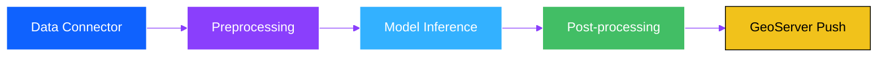

# Key Concepts

Understanding these key concepts will help you work effectively with Geospatial Studio.

## 🗂️ Data Concepts

### Dataset

A **dataset** is a collection of labeled geospatial data used for training AI models.

**Components:**
- **Input Data:** Satellite imagery or raster data (e.g., HLS, Sentinel-2)
- **Labels:** Ground truth annotations (e.g., segmentation masks, class labels)
- **Metadata:** Information about bands, resolution, coordinate system

**Example:**
```
burn-scars-dataset/
├── images/
│   ├── tile_001_merged.tif  # 6-band HLS imagery
│   ├── tile_002_merged.tif
│   └── ...
├── labels/
│   ├── tile_001_mask.tif    # Binary mask (0=no burn, 1=burn)
│   ├── tile_002_mask.tif
│   └── ...
└── metadata.json
```

**Dataset Types:**
- **Segmentation:** Pixel-level classification (e.g., flood mapping)
- **Regression:** Continuous value prediction (e.g., biomass estimation)
- **Classification:** Image-level labels (e.g., land use type)

### Bands

**Bands** are individual channels in multispectral satellite imagery, each capturing different wavelengths of light.

**Common Bands:**
- **Blue** (Band 1): 450-520 nm
- **Green** (Band 2): 520-600 nm
- **Red** (Band 3): 630-680 nm
- **NIR** (Near-Infrared, Band 4): 780-900 nm
- **SWIR1** (Short-wave Infrared 1, Band 5): 1550-1750 nm
- **SWIR2** (Short-wave Infrared 2, Band 6): 2080-2350 nm

**Why Multiple Bands?**
- Different materials reflect different wavelengths
- Vegetation is bright in NIR, dark in Red
- Water absorbs NIR and SWIR
- Enables sophisticated analysis beyond RGB

### Spatial Domain

The **spatial domain** defines the geographic area for processing.

**Specification Methods:**
- **Bounding Box:** `[min_lon, min_lat, max_lon, max_lat]`
- **Polygon:** GeoJSON polygon coordinates
- **Tile:** Specific tile identifiers
- **URL:** Direct link to geospatial file

**Example:**
```json
{
  "spatial_domain": {
    "bbox": [[92.703396, 26.247896, 92.748087, 26.267903]],
    "polygons": [],
    "tiles": [],
    "urls": []
  }
}
```

### Temporal Domain

The **temporal domain** defines the time period for data acquisition.

**Format:** `YYYY-MM-DD_YYYY-MM-DD` (start_end)

**Examples:**
- Single date: `"2024-07-25_2024-07-25"`
- Date range: `"2024-07-25_2024-07-28"`
- Multiple periods: `["2024-01-01_2024-01-15", "2024-06-01_2024-06-15"]`

**Use Cases:**
- **Before/After Analysis:** Compare pre and post-event imagery
- **Time Series:** Track changes over multiple dates
- **Seasonal Analysis:** Compare different seasons

## 🤖 Model Concepts

### Foundation Model (Backbone)

A **foundation model** is a pre-trained AI model that serves as the starting point for fine-tuning.

**Popular Models:**
- **Prithvi EO V1 (100M):** NASA/IBM geospatial foundation model
- **Prithvi EO V2 (300M):** Larger version with better performance
- **Clay V1:** Self-supervised geospatial model
- **TerraMind:** Multi-modal geospatial model

**Why Use Foundation Models?**
- Pre-trained on massive datasets
- Transfer learning reduces training time
- Better performance with less data
- Generalize well to new tasks

### Fine-Tuning (Training)

**Fine-tuning** is the process of adapting a foundation model to a specific task using labeled data.

**Process:**
1. Load pre-trained foundation model
2. Add task-specific head (e.g., segmentation decoder)
3. Train on labeled dataset
4. Validate performance
5. Save checkpoint

**Key Parameters:**
- **Learning Rate:** How fast the model learns (e.g., `6e-5`)
- **Batch Size:** Number of samples per training step
- **Epochs:** Number of passes through the dataset
- **Optimizer:** Algorithm for updating weights (e.g., AdamW)

### Tune (Fine-tuned Model)

A **tune** is a fine-tuned model ready for inference.

**Components:**
- **Checkpoint:** Model weights (`.ckpt` file)
- **Configuration:** Training parameters (`.yaml` file)
- **Metadata:** Performance metrics, training history

**Lifecycle:**


### Model Input Data Spec

Defines how input data should be processed for the model.

**Example:**
```json
{
  "bands": [
    {"index": "0", "band_name": "Blue", "scaling_factor": "0.0001", "RGB_band": "B"},
    {"index": "1", "band_name": "Green", "scaling_factor": "0.0001", "RGB_band": "G"},
    {"index": "2", "band_name": "Red", "scaling_factor": "0.0001", "RGB_band": "R"},
    {"index": "3", "band_name": "NIR_Narrow", "scaling_factor": "0.0001"},
    {"index": "4", "band_name": "SWIR1", "scaling_factor": "0.0001"},
    {"index": "5", "band_name": "SWIR2", "scaling_factor": "0.0001"}
  ],
  "connector": "sentinelhub",
  "collection": "hls_l30",
  "modality_tag": "HLS_L30"
}
```

**Key Fields:**
- **bands:** Band configuration and scaling
- **connector:** Data source (e.g., Sentinel Hub, URL)
- **collection:** Dataset identifier
- **modality_tag:** Model input type

## 🔄 Processing Concepts

### Inference

**Inference** is running a trained model on new data to generate predictions.

**Types:**
- **Try-out:** Quick test on small area
- **Production:** Large-scale processing
- **Batch:** Multiple areas/dates

**Pipeline Steps:**
1. **Data Acquisition:** Fetch satellite imagery
2. **Preprocessing:** Scale, normalize, tile
3. **Model Inference:** Run prediction
4. **Post-processing:** Apply masks, filters
5. **Visualization:** Publish to GeoServer

### Pipeline

A **pipeline** is a sequence of processing steps executed in order.

**Standard Pipeline:**


**Custom Processors:**
- Python-based processing steps
- Configurable parameters
- Chainable operations

### Post-processing

**Post-processing** refines model outputs using auxiliary data.

**Common Operations:**
- **Cloud Masking:** Remove cloudy pixels
- **Ocean Masking:** Exclude ocean areas
- **Snow/Ice Masking:** Filter snow-covered regions
- **Water Masking:** Remove permanent water bodies

**Why Post-process?**
- Reduce false positives
- Focus on relevant areas
- Improve accuracy
- Match domain requirements

## 🎨 Visualization Concepts

### Layer

A **layer** is a geospatial dataset displayed on a map.

**Types:**
- **Raster:** Gridded data (e.g., satellite imagery)
- **Vector:** Points, lines, polygons
- **Tile:** Pre-rendered map tiles

**Properties:**
- **Name:** Identifier
- **Style:** Visual appearance
- **Z-index:** Stacking order
- **Visibility:** Show/hide

### Style

A **style** defines how a layer is visualized.

**Segmentation Style:**
```json
{
  "segmentation": [
    {"quantity": "0", "label": "no-data", "color": "#000000", "opacity": 0},
    {"quantity": "1", "label": "fire-scar", "color": "#ab4f4f", "opacity": 1}
  ]
}
```

**RGB Style:**
```json
{
  "rgb": [
    {"channel": 1, "label": "Red", "minValue": 0, "maxValue": 255},
    {"channel": 2, "label": "Green", "minValue": 0, "maxValue": 255},
    {"channel": 3, "label": "Blue", "minValue": 0, "maxValue": 255}
  ]
}
```

### GeoServer

**GeoServer** is an open-source server for sharing geospatial data.

**Services:**
- **WMS:** Web Map Service (images)
- **WFS:** Web Feature Service (vectors)
- **WCS:** Web Coverage Service (rasters)

**In Geospatial Studio:**
- Automatically publishes inference outputs
- Provides map layers for UI
- Supports dynamic styling

## 🔧 Technical Concepts

### MLflow

**MLflow** is an open-source platform for managing the ML lifecycle.

**Features:**
- **Tracking:** Log parameters, metrics, artifacts
- **Projects:** Package code for reproducibility
- **Models:** Manage model versions
- **Registry:** Central model repository

**In Geospatial Studio:**
- Tracks all training experiments
- Stores model checkpoints
- Compares model performance
- Manages model versions

### Checkpoint

A **checkpoint** is a saved snapshot of model weights.

**Format:** `.ckpt` file (PyTorch Lightning)

**Contains:**
- Model parameters (weights and biases)
- Optimizer state
- Training epoch
- Loss values

**Usage:**
- Resume training
- Deploy for inference
- Share trained models

### Hyperparameter Optimization (HPO)

**HPO** is the process of finding optimal training parameters.

**Optimized Parameters:**
- Learning rate
- Batch size
- Model architecture
- Regularization

**Tool:** Iterate (Ray Tune integration)

**Benefits:**
- Better model performance
- Automated tuning
- Efficient search
- Reproducible results

## 📊 Performance Concepts

### Metrics

**Metrics** measure model performance.

**Segmentation Metrics:**
- **IoU (Intersection over Union):** Overlap between prediction and ground truth
- **F1 Score:** Harmonic mean of precision and recall
- **Accuracy:** Percentage of correct predictions
- **Precision:** True positives / (True positives + False positives)
- **Recall:** True positives / (True positives + False negatives)

**Regression Metrics:**
- **MAE (Mean Absolute Error):** Average absolute difference
- **RMSE (Root Mean Square Error):** Square root of average squared difference
- **R² Score:** Proportion of variance explained

### Validation

**Validation** assesses model performance on unseen data.

**Split Types:**
- **Training Set:** 70-80% of data for learning
- **Validation Set:** 10-15% for hyperparameter tuning
- **Test Set:** 10-15% for final evaluation

**Cross-validation:** Multiple train/validation splits for robust evaluation

## 🔑 Authentication Concepts

### API Key

An **API key** is a token for programmatic authentication.

**Properties:**
- User-specific
- Revocable
- Limited to 2 active keys per user

**Usage:**
```python
from geostudio import Client

client = Client(
    api_key="your-api-key",
    base_url="https://localhost:4180"
)
```

**Security:**
- Store in environment variables
- Never commit to version control
- Rotate regularly

### OAuth2

**OAuth2** is the authentication protocol for UI access.

**Flow:**
1. User accesses UI
2. Redirected to Keycloak
3. Enters credentials
4. Receives access token
5. Token used for API requests

## 📚 Quick Reference

| Concept | Description | Example |
|---------|-------------|---------|
| **Dataset** | Labeled training data | Burn scars imagery + masks |
| **Foundation Model** | Pre-trained model | Prithvi EO V2 300M |
| **Fine-tuning** | Adapt model to task | Train on flood data |
| **Tune** | Fine-tuned model | Flood detection model |
| **Inference** | Run model on new data | Map flood extent |
| **Pipeline** | Processing workflow | Data → Model → Output |
| **Layer** | Map visualization | Flood extent overlay |
| **MLflow** | Experiment tracking | Training metrics |
| **API Key** | Authentication token | SDK access |

## 🎓 Next Steps

Now that you understand the key concepts, you're ready to start using Geospatial Studio!

- [Start Lab 1 →](../notebooks/lab1-getting-started.ipynb) - Get hands-on experience
- [Back to Welcome →](welcome.md) - Review workshop overview

---

[← Back: Architecture](architecture.md){ .md-button } [Next: Lab 1 - Getting Started →](../notebooks/lab1-getting-started.ipynb){ .md-button .md-button--primary }
