# Welcome to the Workshop!

Welcome to the **IBM Geospatial Studio Workshop**! We're excited to guide you through this hands-on learning experience.

## 👋 Introduction

Over the next few hours, you'll learn how to use Geospatial Studio - a powerful platform for working with geospatial AI models. Whether you're analyzing satellite imagery for environmental monitoring, disaster response, or climate research, this workshop will give you the skills to get started.

## 🎯 Learning Objectives

By the end of this workshop, you will:

1. **Understand** the Geospatial Studio architecture and components
2. **Navigate** the Studio UI confidently
3. **Use** the Python SDK for programmatic access
4. **Run** inference with fine-tuned models
5. **Onboard** datasets for model training
6. **Fine-tune** models for specific tasks
7. **Execute** complete workflows from data to insights

## 👥 Who This Workshop Is For

This workshop is designed for:

- **Data Scientists** exploring geospatial AI
- **Researchers** working with Earth observation data
- **Developers** building geospatial applications
- **Students** learning about AI and remote sensing
- **Anyone** curious about applying AI to satellite imagery

## 📚 What You Need to Know

### Required Knowledge

- Basic Python programming
- Familiarity with Jupyter notebooks (helpful)
- Understanding of basic machine learning concepts (helpful)

### No Prior Experience Needed With

- Geospatial data formats
- Satellite imagery analysis
- Deep learning frameworks
- Kubernetes/containers

We'll explain these concepts as we go!

## 🗺️ Workshop Roadmap

```mermaid
%%{init: {'theme':'base', 'themeVariables': { 'primaryColor':'#0f62fe','primaryTextColor':'#fff','primaryBorderColor':'#fff','lineColor':'#8a3ffc','secondaryColor':'#33b1ff','tertiaryColor':'#42be65'}}}%%
graph LR
    A[Pre-work<br/>Deploy Studio] --> B[Introduction<br/>Learn Concepts]
    B --> C[Lab 1<br/>Getting Started]
    C --> D[Lab 2<br/>Onboard Examples]
    D --> E[Lab 3<br/>Upload & Infer]
    E --> F[Lab 4<br/>Train Model]
    F --> G[Lab 5<br/>Multimodal AI]
    
    style A fill:#0f62fe,stroke:#fff,color:#fff
    style B fill:#8a3ffc,stroke:#fff,color:#fff
    style C fill:#33b1ff,stroke:#fff,color:#fff
    style D fill:#42be65,stroke:#fff,color:#fff
    style E fill:#ff7eb6,stroke:#fff,color:#fff
    style F fill:#fa4d56,stroke:#fff,color:#fff
    style G fill:#ee5396,stroke:#fff,color:#fff
```



## ⏱️ Time Breakdown

| Section | Duration | Description |
|---------|----------|-------------|
| **Pre-work** | 1-1.5 hours | Deploy Geospatial Studio |
| **Introduction** | 15 minutes | Platform overview and concepts |
| **Lab 1** | 10 minutes | Getting Started with IBM Geospatial Studio (Beginner) |
| **Lab 2** | 20 minutes | Onboarding Pre-computed Examples (Beginner) |
| **Lab 3** | 30 minutes | Upload Model Checkpoints and Run Inference (Intermediate) |
| **Lab 4** | 60-90 minutes | Training a Custom Model for Wildfire Burn Scar Detection (Intermediate) |
| **Lab 5** | 90-120 minutes | Training a Multimodal Model for Flood Detection (Advanced) |
| **Total** | ~5-6 hours | Including breaks |

## 🎓 Workshop Format

### Hands-On Labs

Each lab includes:

- **Concepts** - Learn the theory
- **Demonstrations** - See it in action
- **Exercises** - Try it yourself
- **Solutions** - Check your work

### Learning Approach

We follow a progressive learning path:

1. **Observe** - Watch demonstrations
2. **Practice** - Complete guided exercises
3. **Apply** - Work on real-world scenarios
4. **Extend** - Explore on your own

## 💡 Tips for Success

### Before You Start

- ✅ Complete the pre-work deployment
- ✅ Verify your installation works
- ✅ Have your API key ready
- ✅ Open the Studio UI in a browser
- ✅ Have a code editor or Jupyter ready

### During the Workshop

- 📝 Take notes on key concepts
- 🤔 Ask questions when unclear
- 💻 Type the code yourself (don't just copy-paste)
- 🔍 Explore beyond the exercises
- 🤝 Collaborate with others if in a group setting

### If You Get Stuck

1. Check the error message carefully
2. Review the troubleshooting section
3. Consult the FAQ
4. Ask for help (instructor or community)
5. Take a break and come back fresh

## 🛠️ Workshop Environment

You should have:

- ✅ Geospatial Studio deployed and running
- ✅ Access to the Studio UI at `https://localhost:4180`
- ✅ API key generated and saved
- ✅ Python environment with SDK installed
- ✅ Jupyter notebook or code editor ready

### Quick Environment Check

Run this quick check:

```python
from geostudio import Client
import urllib3
urllib3.disable_warnings(urllib3.exceptions.InsecureRequestWarning)

# Test connection
client = Client(geostudio_config_file=".geostudio_config_file")
models = client.list_models()
print(f"✅ Connected! Found {len(models)} models")
```

If this works, you're ready to go!

## 📖 Workshop Materials

All materials are available in this documentation:

- **Slides** - Concept explanations
- **Code Examples** - Copy-paste ready
- **Notebooks** - Interactive exercises
- **Sample Data** - Pre-configured datasets
- **Reference** - API documentation

## 🎯 What We'll Build

Throughout this workshop, you'll work on real geospatial AI applications:

### Lab 2: Onboarding Pre-computed Examples
Learn to onboard geospatial data and configure visualization layers for raster and vector data.

### Lab 3: Upload Model Checkpoints and Run Inference
Upload fine-tuned model checkpoints and run inference on satellite imagery to detect features like floods.

### Lab 4: Wildfire Burn Scar Detection
Complete end-to-end workflow:
1. Onboard labeled training data
2. Fine-tune a foundation model
3. Run inference on real wildfire events
4. Visualize and analyze burn scar results

## 🌟 Beyond the Workshop

After completing this workshop, you'll be ready to:

- Build your own geospatial AI applications
- Fine-tune models for custom use cases
- Process large-scale satellite imagery
- Contribute to the Geospatial Studio community

## 📚 Additional Resources

Keep these handy during the workshop:

- [Geospatial Studio Docs](https://terrastackai.github.io/geospatial-studio/)
- [SDK Documentation](https://terrastackai.github.io/geospatial-studio-toolkit/)
- [Example Notebooks](https://github.com/terrastackai/geospatial-studio-toolkit/tree/main/examples)
- [Troubleshooting Guide](../resources/troubleshooting.md)
- [FAQ](../resources/faq.md)

## 🚀 Ready to Begin?

Let's start by understanding what Geospatial Studio is and how it works.

---

[Next: What is Geospatial Studio? →](what-is-geospatial-studio.md){ .md-button .md-button--primary }