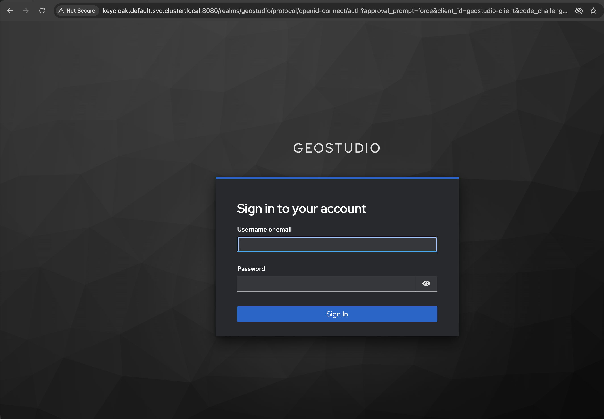
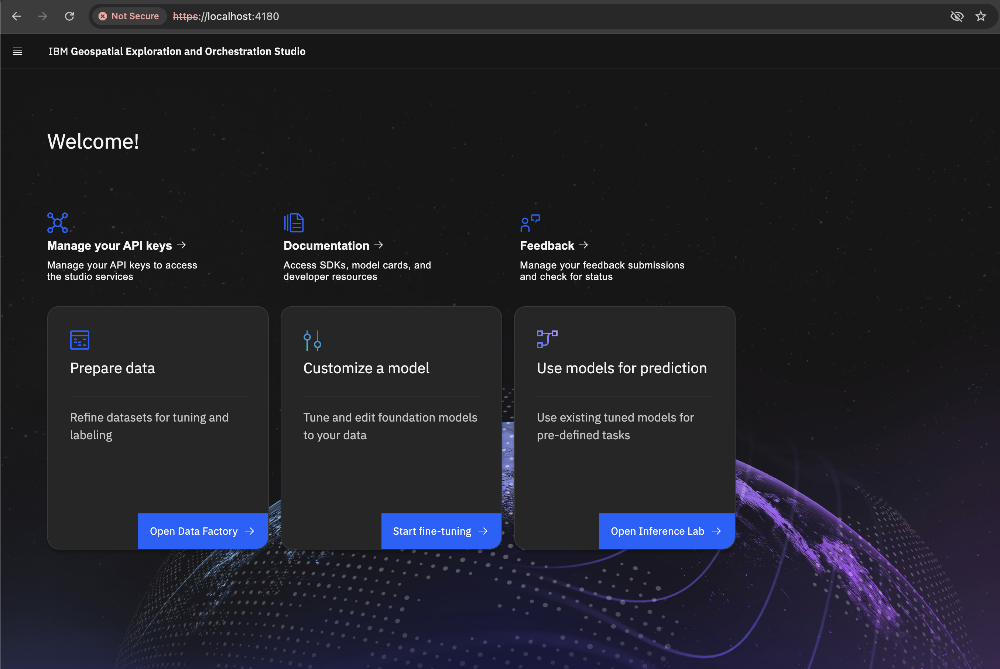

# Deployment Verification

After deploying Geospatial Studio, verify that all components are working correctly before proceeding to the workshop labs.

!!! success "Verification Time"
    **Estimated time:** 10 minutes

## Step 1: Check Pod Status

Verify all pods are running:

=== "Local Deployment"
    ```bash
    export KUBECONFIG="$HOME/.lima/studio/copied-from-guest/kubeconfig.yaml"
    kubectl get pods
    ```

=== "Cluster Deployment"
    ```bash
    kubectl get pods -n <your-namespace>
    ```

Expected output - all pods should show `Running` or `Completed`:

```
NAME                              READY   STATUS    RESTARTS   AGE
geofm-gateway-xxx                 1/1     Running   0          5m
geofm-ui-xxx                      1/1     Running   0          5m
geofm-mlflow-xxx                  1/1     Running   0          5m
geofm-geoserver-xxx               1/1     Running   0          5m
postgresql-xxx                    1/1     Running   0          8m
keycloak-xxx                      1/1     Running   0          8m
minio-xxx                         1/1     Running   0          8m
redis-xxx                         1/1     Running   0          8m
```

!!! warning "Troubleshooting"
    If any pods show `Error`, `CrashLoopBackOff`, or `Pending`, check the [Troubleshooting Guide](../resources/troubleshooting.md).

## Step 2: Verify Service Access

### Studio UI

1. Open [https://localhost:4180](https://localhost:4180) (local) or your cluster URL
2. Accept the security warning (self-signed certificate)
3. You should see the login page

<figure markdown>
  { width="750" loading=lazy }
  <figcaption>Geospatial Studio Login Page</figcaption>
</figure>

### Login Test

1. Enter credentials:
   - Username: `testuser`
   - Password: `testpass123`
2. Click "Sign In"
3. You should see the Studio home page

<figure markdown>
  { width="750" loading=lazy }
  <figcaption>Geospatial Studio Home Page - Main Interface</figcaption>
</figure>

### API Access

Test the API endpoint:

```bash
# For local deployment
curl -k https://localhost:4181/health
```

Expected response (authentication redirect):
```html
<a href="http://keycloak.default.svc.cluster.local:8080/realms/geostudio/protocol/openid-connect/auth...">Found</a>
```

!!! warning "Authentication Required"
    The `/health` endpoint requires authentication and will redirect to Keycloak login. This confirms the API gateway is running and properly configured with authentication. To make authenticated API calls, you'll need to create an API key (see Step 3 below).

!!! tip "Alternative: Check Pod Status"
    To verify the API gateway is running without authentication, check the pod status:
    ```bash
    kubectl get pods | grep geofm-gateway
    ```
    The pod should show `Running` status.

## Step 3: Create and Test API Key

### Create API Key

1. On the Studio home page, click "Manage your API keys"
2. Click "Generate new key"
3. Copy the generated API key
4. Save it to a config file:

```bash
echo "GEOSTUDIO_API_KEY=<your-api-key>" > ~/.geostudio_config_file
echo "BASE_STUDIO_UI_URL=https://localhost:4180" >> ~/.geostudio_config_file
```

### Test API Key

```bash
# Set environment variables
export STUDIO_API_KEY="<your-api-key>"
export UI_ROUTE_URL="https://localhost:4180"

# Test API call
curl -k -X GET "${UI_ROUTE_URL}/studio-gateway/v2/models" \
  -H "X-API-Key: ${STUDIO_API_KEY}"
```

Expected response: JSON array of models (may be empty initially)

## Step 4: Verify Backend Services

### GeoServer

1. Open [http://localhost:3000/geoserver](http://localhost:3000/geoserver)
2. Login with:
   - Username: `admin`
   - Password: `geoserver`
3. You should see the GeoServer admin interface

### MLflow

1. Open [http://localhost:5000](http://localhost:5000)
2. You should see the MLflow tracking UI
3. No login required

### MinIO

1. Open [https://localhost:9001](https://localhost:9001)
2. Login with:
   - Username: `minioadmin`
   - Password: `minioadmin`
3. You should see the MinIO console

## Step 5: Onboard Sandbox Models

Onboard placeholder models for testing:

```bash
export STUDIO_API_KEY="<your-api-key>"
export UI_ROUTE_URL="https://localhost:4180"

./deployment-scripts/add-sandbox-models.sh
```

Expected output:
```
✅ Onboarding sandbox model: geofm-sandbox-models
✅ Model onboarded successfully
```

Verify in UI:
1. Navigate to "Models" page
2. You should see "geofm-sandbox-models" listed

## Step 6: Test Python SDK

Create a test script:

```python
# test_sdk.py
from geostudio import Client
import urllib3
urllib3.disable_warnings(urllib3.exceptions.InsecureRequestWarning)

# Initialize client
client = Client(geostudio_config_file=".geostudio_config_file")

# List models
models = client.list_models()
print(f"✅ Found {len(models)} models")

# List datasets
datasets = client.list_datasets()
print(f"✅ Found {len(datasets)} datasets")

print("✅ SDK verification complete!")
```

Run the test:

```bash
python test_sdk.py
```

Expected output:
```
✅ Found 1 models
✅ Found 0 datasets
✅ SDK verification complete!
```

## Step 7: Verification Checklist

Confirm all items are working:

- [ ] All pods are running
- [ ] Studio UI is accessible
- [ ] Can login to Studio UI
- [ ] API health check passes
- [ ] API key created and working
- [ ] GeoServer is accessible
- [ ] MLflow is accessible
- [ ] MinIO is accessible
- [ ] Sandbox models onboarded
- [ ] Python SDK working

## Troubleshooting Common Issues

### Cannot Access UI

??? question "Connection refused or timeout"
    **Local Deployment:**
    ```bash
    # Check port forwarding
    ps aux | grep "kubectl port-forward"
    
    # Restart port forwarding if needed
    export OC_PROJECT=default
    kubectl port-forward -n $OC_PROJECT deployment/geofm-ui 4180:4180 >> studio-pf.log 2>&1 &
    ```
    
    **Cluster Deployment:**
    ```bash
    # Check ingress/route
    kubectl get ingress -n <namespace>
    oc get routes -n <namespace>
    ```

### API Key Not Working

??? question "401 Unauthorized error"
    1. Verify API key is correct
    2. Check it's properly set in environment variable
    3. Ensure no extra spaces or newlines
    4. Try generating a new API key

### Pods Not Running

??? question "Pods in Error or CrashLoopBackOff state"
    ```bash
    # Check pod logs
    kubectl logs <pod-name>
    
    # Check pod events
    kubectl describe pod <pod-name>
    
    # Common issues:
    # - Insufficient resources
    # - Image pull errors
    # - Configuration errors
    ```

### SDK Connection Issues

??? question "Cannot connect to Studio"
    1. Verify `BASE_STUDIO_UI_URL` is correct
    2. Check API key is valid
    3. For local deployment, ensure port forwarding is active
    4. Try with `verify_ssl=False` for self-signed certificates:
    ```python
    client = Client(
        geostudio_config_file=".geostudio_config_file",
        verify_ssl=False
    )
    ```

## Performance Verification

### Check Resource Usage

```bash
# Check node resources
kubectl top nodes

# Check pod resources
kubectl top pods -n <namespace>
```

### Database Connection

```bash
# Test PostgreSQL connection
kubectl exec -it <postgresql-pod> -- psql -U postgres -c "SELECT version();"
```

### Object Storage

```bash
# List MinIO buckets
kubectl exec -it <minio-pod> -- mc ls local/
```

## Next Steps

✅ **Verification Complete!** Your Geospatial Studio deployment is ready.

Proceed to:

1. [Introduction →](../introduction/welcome.md) - Learn about Geospatial Studio
2. [Lab 1 →](../notebooks/lab1-getting-started.ipynb) - Start the hands-on labs

## Additional Resources

- [Troubleshooting Guide](../resources/troubleshooting.md)
- [FAQ](../resources/faq.md)
- [Official Documentation](https://terrastackai.github.io/geospatial-studio/)

---

[← Back to Deployment](local-deployment.md){ .md-button } [Next: Introduction →](../introduction/welcome.md){ .md-button .md-button--primary }